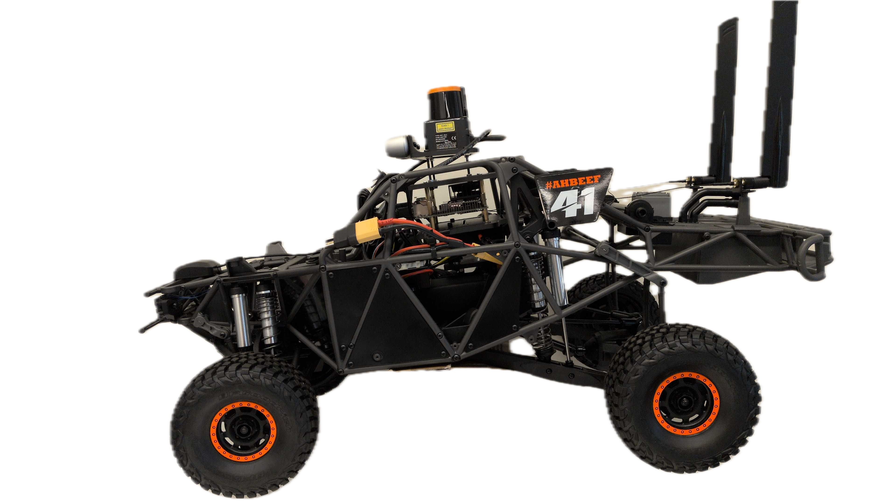

# CRAL – Chandra Robot Autonomy Lab, University of Virginia

Welcome to the **Chandra Robot Autonomy Lab (CRAL)** at the University of Virginia! This profile serves as a central hub for our robotics **research, documentation, and resources.**

## CRAL's Robots

Our lab utilizes a range of mobile platforms for research in autonomous **navigation, perception, and control.** Click on a robot's image below to view its **full documentation, specifications, and usage guides.**

<table>
<tr>
<td align="center">
<a href="https://cral-uva.readthedocs.io/en/latest/" style="text-decoration: none;">
    
     
    <strong>Clearpath Jackal</strong>
</a>
</td>
<td align="center" style="padding: 0 20px;">
<a href="https://cral-uva-traxxas.readthedocs.io/en/latest/" style="text-decoration: none;">
    
     
    <strong>Traxxas UDR</strong>
</a>
</td>
</tr>
</table>

***

### Platform Details

* **Clearpath Jackal:** A medium-sized, all-terrain mobile research platform. It is rugged, weatherproof, and **ROS-ready** for robust indoor and outdoor experimentation.
* **Traxxas Vehicles:** Cost-effective, high-speed platforms used for **scaled experiments** in control systems and motion planning, serving as a reliable testbed for agile navigation algorithms.

## 💻 Software Stack

We use **NVIDIA Isaac Sim/Isaac SDK** (referred to as **Isaac**) as our primary robotics simulation and development platform. Documentation and guides for Isaac integration will be added to the relevant robot documentation pages as they become available.

## 🌐 Connect With Us

* **Website:** [cral.virginia.edu](https://cral-uva.github.io/)
* **Twitter/X:** [@CRAL\_UVA](https://x.com/CRAL_UVA)

***
*Maintained by the CRAL-UVA team. Last updated: November 2025.*

