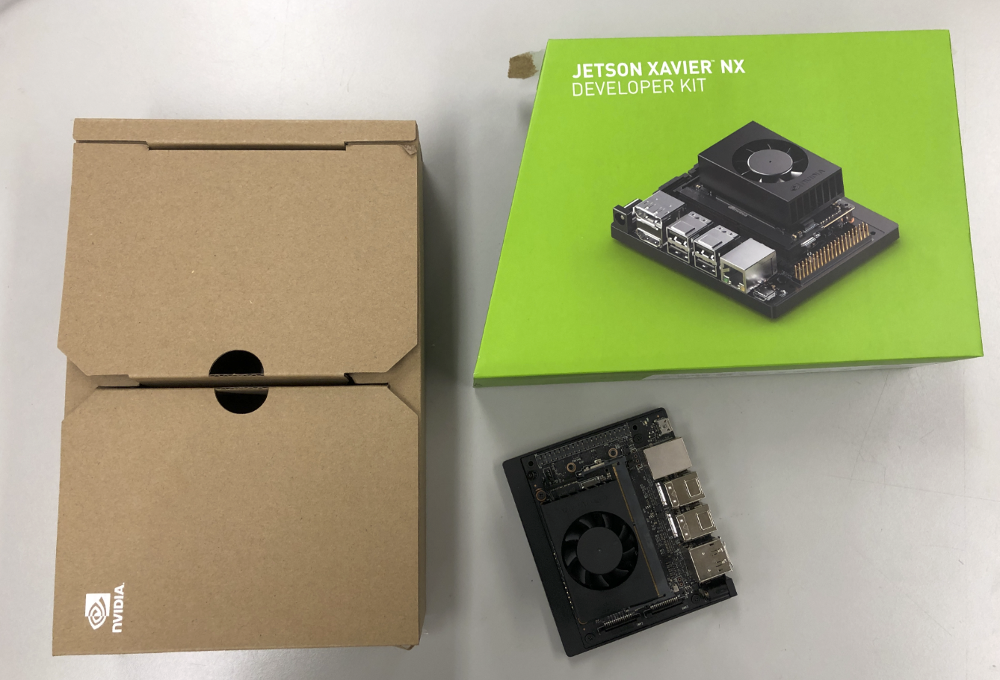
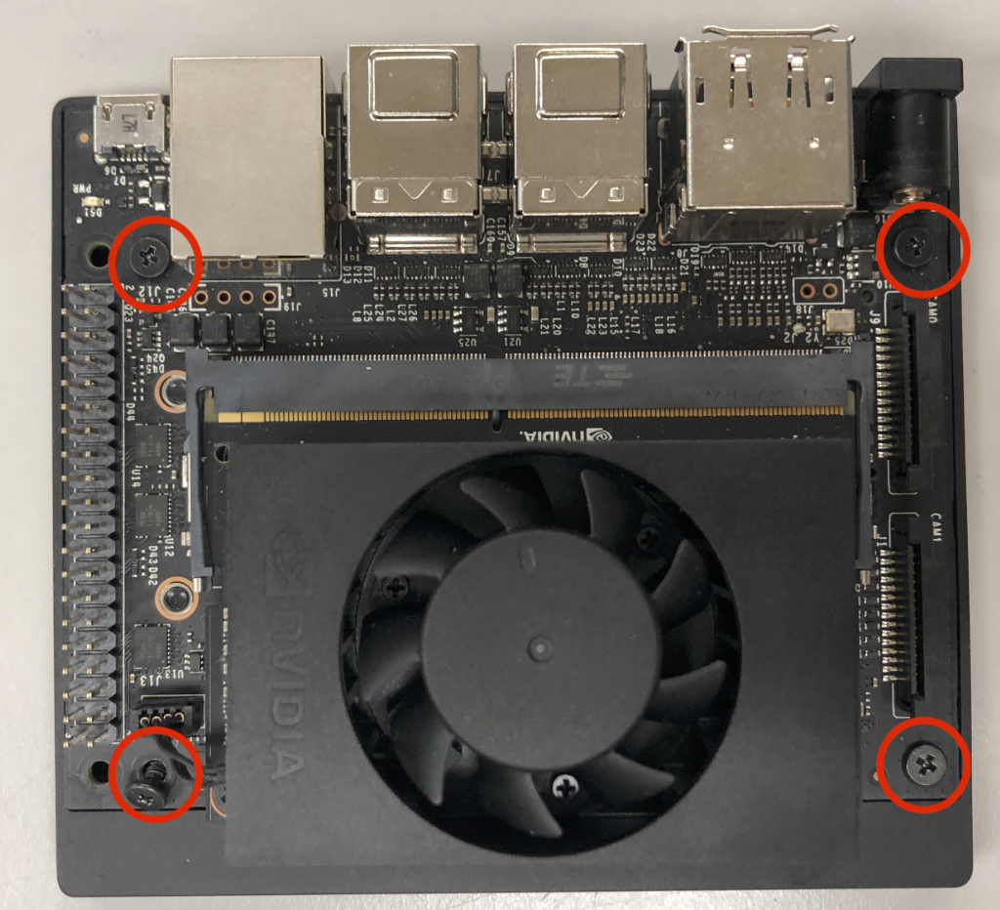
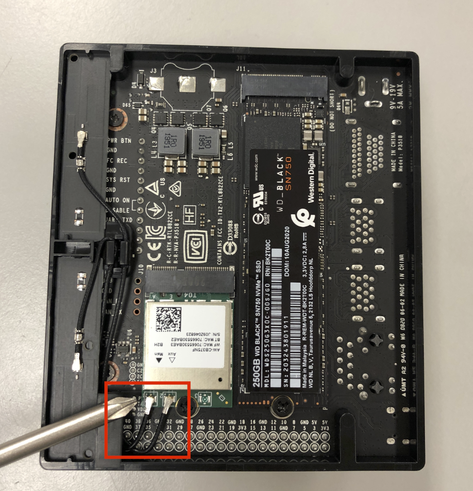

## 1. Initial Setup
1. **Installation Information:**
   - JetPack is flashed using NVIDIA SDK Manager (Linux Docker or Windows host)
   - Follow NVIDIA's official documentation for JetPack installation
   - Ensure compatibility with ROS 2 

## 2. Setup Procedure

1. Unbox all the items

2. Remove all the screws highlighted in the image 

3. Unplug the 2 antenna cables too from the board 

4. Plug in the bigger wifi antennas for wider coverage 

1. Once that is done, lets setup the jetson
    - Follow this tutorial to install the jetson software(Ubuntu environment)

       