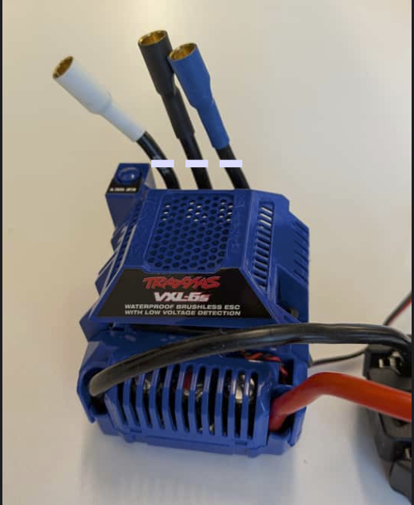
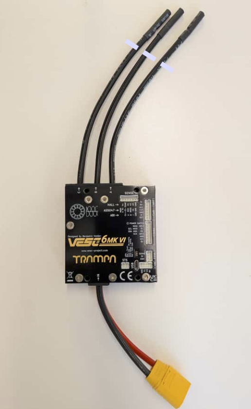
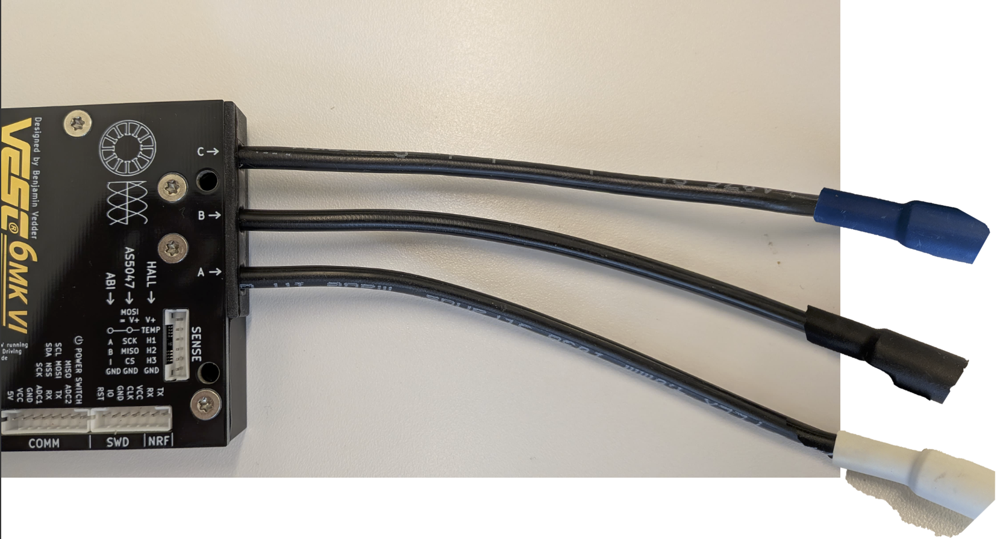

## 1. VESC wire soldering 
Since the pins are not the same for the Motors and the VESC, we will have to solder the vesc with the older vxl pins. We are soldering and not using a connector to reduce the point of failures 

1. Chop of the three pins from the vxl-6s, based on the white dooted line

2. Cut the three wires in the vesc 6mk

3. Now we need to solder the three pieces from the vxl-6s to the VESC 
4. The order is as follows, use the marking in the VESC a
- A - White 
- B - Black 
- C - Blue 

PLEASE ADD THE HEAT SHRINKS BEFORE STARTING THE SOLDERING 

Once done, we can move on to the vesc tune up [VESC SETUP](../Upper_stack/vesc.md)